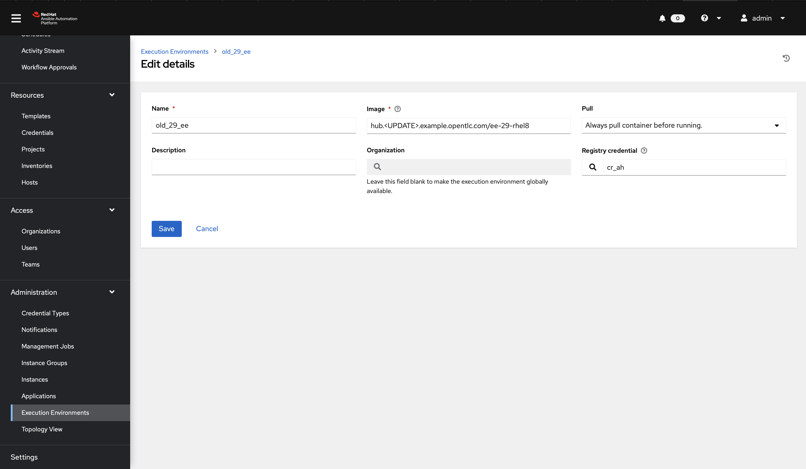
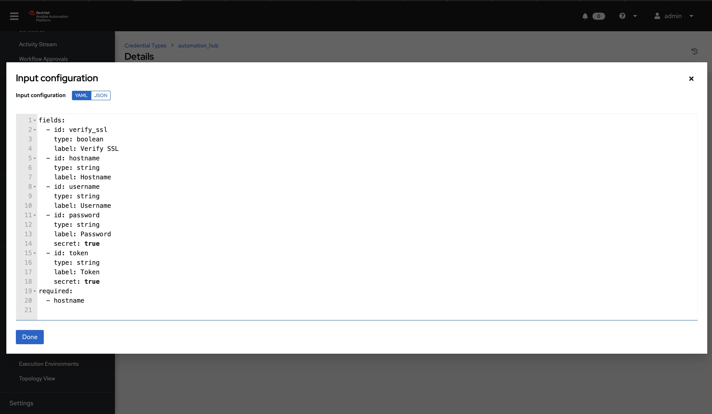
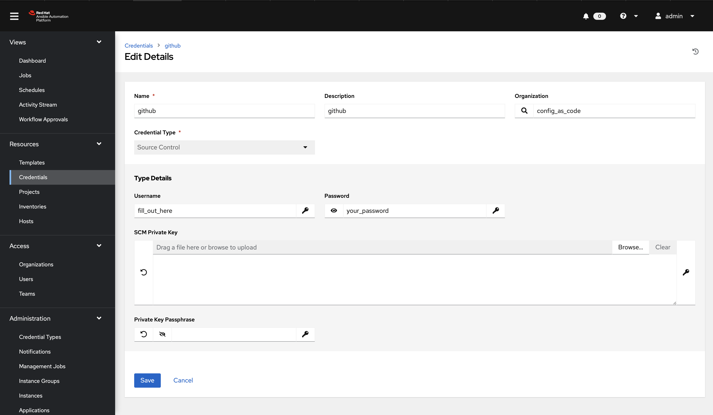
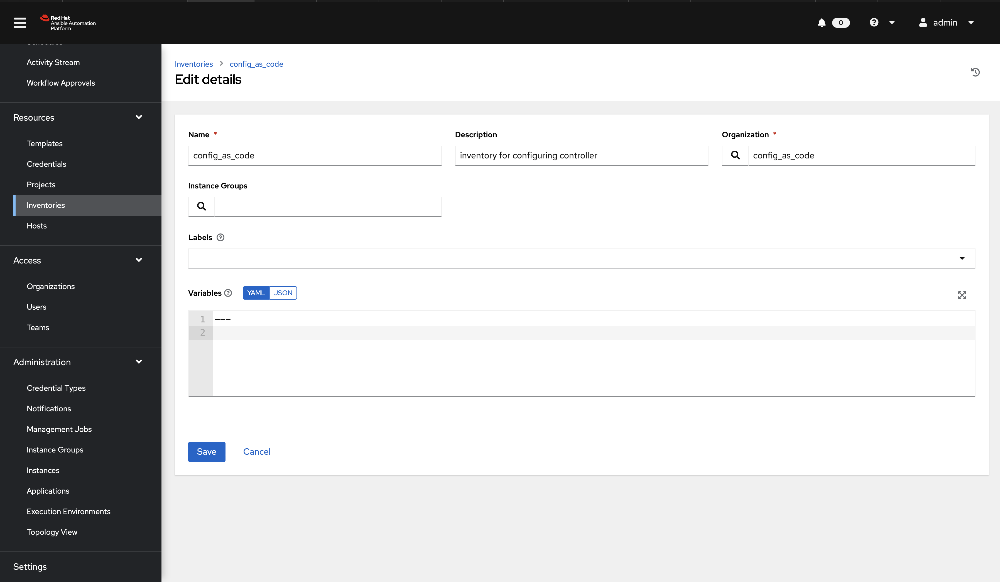
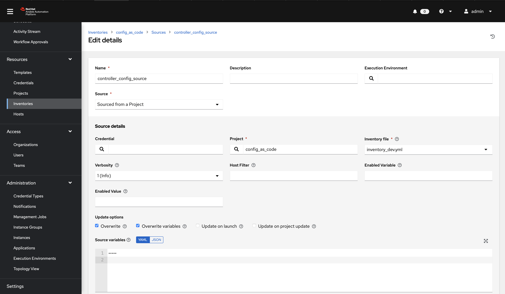

# Intro

In this section, you will only be given a summary of the objects you need to create along with some screenshots of a controller that is configured with the completed code. You will also be provided the variables sections from the readme's for each of the required roles to help you complete this task.

## Step 1

Create a file `group_vars/all/settings.yml` and copy all this into the file.

```yaml
---
controller_settings:
  settings:
    GALAXY_IGNORE_CERTS: true
...
```

Further documentation for those who are interested to learn more see:

- [settings role](https://github.com/redhat-cop/controller_configuration/blob/devel/roles/settings/README.md)

## Step 2

Create a file `group_vars/all/execution_environments.yml` and add the required information to the list `controller_execution_environments` to configure the UI to look like the screenshots

```yaml
---
controller_execution_environments:

...

```




Further documentation for those who are interested to learn more see:

- [execution environments role](https://github.com/redhat-cop/controller_configuration/blob/devel/roles/execution_environments/README.md)


## Step 3

Create a file `group_vars/all/credential_types.yml` and add the required information to the list `controller_credential_types` to create also credential type called `automation_hub` with the values from the screenshot.

Make sure to keep the ssh_priv_file credential type.



```yaml
---
controller_credential_types:
  - name: ssh_priv_file
    kind: cloud
    description: creates temp ssh priv key to use (cannot have passphrase)
    inputs:
      fields:
        - id: priv_key
          type: string
          label: Certificate
          format: ssh_private_key
          multiline: true
          secret: true
    injectors:
      env:
        MY_CERT_FILE_PATH: !unsafe '{{ tower.filename.cert_file }}'
      file:
        template.cert_file: !unsafe '{{ priv_key }}'
...
```






Further documentation for those who are interested to learn more see:

- [credential types role](https://github.com/redhat-cop/controller_configuration/blob/devel/roles/credential_types/README.md)

## Step 4

Create a file `group_vars/all/organizations.yml` and add the required information to the list `controller_organizations` to configure the UI to look like the screenshot

```yaml
---
controller_organizations:

...

```


Further documentation for those who are interested to learn more see:

- [organizations role](https://github.com/redhat-cop/controller_configuration/blob/devel/roles/organizations/README.md)

## Step 5

Create a file `group_vars/all/credentials.yml` and add the required information to the list `controller_credentials` to configure the UI to look like the screenshot



```yaml
---
controller_credentials:
  - name: aap_admin
    credential_type: Red Hat Ansible Automation Platform
    organization: config_as_code
    description: aap admin account
    inputs:
      host: "{{ controller_hostname }}"
      username: "{{ controller_username }}"
      password: "{{ controller_password }}"
      verify_ssl: false

  - name: ah_token_user
    credential_type: automation_hub
    organization: config_as_code
    description: automation hub api account
    inputs:
      hostname: "{{ ah_host }}"
      username: "{{ ah_token_username }}"
      token: "{{ ah_token }}"
      verify_ssl: false

  - name: ah_certified
    credential_type: Ansible Galaxy/Automation Hub API Token
    organization: config_as_code
    inputs:
      url: "https://{{ ah_host }}/api/galaxy/content/rh-certified/"
      token: "{{ ah_token }}"

  - name: ah_published
    credential_type: Ansible Galaxy/Automation Hub API Token
    organization: config_as_code
    inputs:
      url: "https://{{ ah_host }}/api/galaxy/content/published/"
      token: "{{ ah_token }}"

  - name: ah_community
    credential_type: Ansible Galaxy/Automation Hub API Token
    organization: config_as_code
    inputs:
      url: "https://{{ ah_host }}/api/galaxy/content/community/"
      token: "{{ ah_token }}"

  - name: cr_ah
    credential_type: Container Registry
    organization: config_as_code
    inputs:
      host: "{{ ah_host }}"
      username: "{{ ah_username }}"
      password: "{{ ah_password }}"
      verify_ssl: false

  - name: root
    credential_type: Machine
    organization: config_as_code
    description: local password
    inputs:
      username: "{{ student_num }}"
      password: "{{ machine_pass }}"

  - name: git
    credential_type: Source Control
    organization: config_as_code
    description: git
    inputs:
      username: "{{ student_num }}"
      password: "{{ machine_pass }}"

  - name: vault
    credential_type: Vault
    organization: config_as_code
    description: vault password
    inputs:
      vault_password: "{{ vault_pass }}"
...
```






Further documentation for those who are interested to learn more see:

- [credentials role](https://github.com/redhat-cop/controller_configuration/blob/devel/roles/credentials/README.md)

## Step 6

Create a file `group_vars/all/projects.yml` and add the required information to the list `controller_projects` to configure the UI to look like the screenshot.

### What git project are we pointing at

```yaml
---
controller_projects:

...
```


Further documentation for those who are interested to learn more see:

- [projects role](https://github.com/redhat-cop/controller_configuration/blob/devel/roles/projects/README.md)

## Step 7

Create a file `group_vars/all/inventories.yml` and add the required information to the list `controller_inventories` to configure the UI to look like the screenshot

```yaml
---
controller_inventories:

...
```



Further documentation for those who are interested to learn more see:

- [inventories role](https://github.com/redhat-cop/controller_configuration/blob/devel/roles/inventories/README.md)

## Step 8

Create a file `group_vars/all/inventory_sources.yml` and add the required information to the list `controller_inventory_sources` to configure the UI to look like the screenshot
**WE never declared an inventory files here yet, and never declared the env variable**

```yaml
---
controller_inventory_sources:

...
```



Further documentation for those who are interested to learn more see:

- [inventory sources role](https://github.com/redhat-cop/controller_configuration/blob/devel/roles/inventory_sources/README.md)

## Step 9

Create a file `group_vars/all/job_templates.yml` and add the required information to the list `controller_templates` to configure the UI to look like the screenshot

Pay attention to the credentials attached to each job template.

**remove labels from the example for build_execution_environment image**
**need example project to test this as job templates not matching playbook causing failure**

```yaml
---
controller_templates:

...
```


Further documentation for those who are interested to learn more see:

- [job templates role](https://github.com/redhat-cop/controller_configuration/blob/devel/roles/job_templates/README.md)

## Step 10

Create a playbook `playbooks/controller_config.yml` and copy all this into the file.



```yaml
---
- name: Playbook to configure ansible controller post installation
  hosts: all
  vars_files:
    - "../vaults.yml"
  connection: local
  tasks:
    - name: include setting role
      ansible.builtin.include_role:
        name: redhat_cop.controller_configuration.settings
      when: controller_settings is defined

    - name: include organization role
      ansible.builtin.include_role:
        name: redhat_cop.controller_configuration.organizations
      vars:
        assign_galaxy_credentials_to_org: false
      when: controller_organizations is defined

    - name: include labels role
      ansible.builtin.include_role:
        name: redhat_cop.controller_configuration.labels
      when: controller_labels is defined

    - name: include users role
      ansible.builtin.include_role:
        name: redhat_cop.controller_configuration.users
      vars:
        controller_configuration_users_secure_logging: true
      when: controller_user_accounts is defined

    - name: include teams role
      ansible.builtin.include_role:
        name: redhat_cop.controller_configuration.teams
      when: controller_teams is defined

   # probably not optimal but works, looking for better solutions
    - name: Figuring out AH token
      block:
        - name: Authenticate and get an API token from Automation Hub
          redhat_cop.ah_configuration.ah_token:
            ah_host: "{{ ah_host | default(groups['automationhub'][0]) }}"
            ah_username: "{{ ah_token_username | default('admin') }}"
            ah_password: "{{ ah_token_password }}"
            ah_path_prefix: 'galaxy' # this is for private automation hub
            validate_certs: false
          register: r_ah_token

        - name: Fixing format
          ansible.builtin.set_fact:
            ah_token: "{{ ah_token['token'] }}"
          when: r_ah_token['changed']
      when: ah_token is not defined or ah_token['token'] is defined

    - name: update credentials
      block:
        - name: include credential_types role
          ansible.builtin.include_role:
            name: redhat_cop.controller_configuration.credential_types
          when: controller_credential_types is defined

      rescue:
        - name: pulling credential_types list
          ansible.builtin.set_fact:
            cf_current_credential_types: "{{ cf_current_credential_types | default([]) + [{ 'name' : item.name, 'state' : 'absent'}] }}"
          loop: "{{ _current_cred_types }}"
          vars:
            _current_cred_types: "{{ lookup('awx.awx.tower_api', 'credential_types', query_params={ 'managed': false } ,host=controller_hostname, username=controller_username, password=controller_password, verify_ssl=controller_validate_certs) }}"
#            _current_cred_types: "{{ lookup('ansible.controller.controller_api', 'credential_types', query_params={ 'namespace__isnull': true } ,host=controller_hostname, username=controller_username, password=controller_password, verify_ssl=controller_validate_certs) }}"

        - name: pulling credentials list
          ansible.builtin.set_fact:
            cf_current_credentials: "{{ cf_current_credentials | default([]) + [{ 'name' : item.name, 'credential_type' : item.credential_type, 'state' : 'absent'}] }}"
          loop: "{{ _current_credentials }}"
          vars:
            _current_credentials: "{{ lookup('awx.awx.tower_api', 'credentials', query_params={ 'managed': false }, host=controller_hostname, username=controller_username, password=controller_password, verify_ssl=controller_validate_certs) }}"
#            _current_cred_types: "{{ lookup('ansible.controller.controller_api', 'credentials', host=controller_hostname, username=controller_username, password=controller_password, verify_ssl=controller_validate_certs) }}"

        - name: include credentials role
          ansible.builtin.include_role:
            name: redhat_cop.controller_configuration.credentials
          vars:
            controller_credentials: "{{ cf_current_credentials }}"
            controller_configuration_credentials_secure_logging: false

        - name: include credential_types role
          ansible.builtin.include_role:
            name: redhat_cop.controller_configuration.credential_types
          vars:
            controller_credential_types: "{{ cf_current_credential_types }}"

        - name: include credential_types role
          ansible.builtin.include_role:
            name: redhat_cop.controller_configuration.credential_types

    - name: include credential role
      ansible.builtin.include_role:
        name: redhat_cop.controller_configuration.credentials
      vars:
        controller_configuration_credentials_secure_logging: true
      when: controller_credentials is defined

    - name: include credential_input_sources role
      ansible.builtin.include_role:
        name: redhat_cop.controller_configuration.credential_input_sources
      when: controller_credential_input_sources is defined

    - name: include execution_environments role
      ansible.builtin.include_role:
        name: redhat_cop.controller_configuration.execution_environments
      when: controller_execution_environments is defined

    - name: include organizations role
      ansible.builtin.include_role:
        name: redhat_cop.controller_configuration.organizations
      when: controller_organizations is defined

    - name: include projects role
      ansible.builtin.include_role:
        name: redhat_cop.controller_configuration.projects
      when: controller_projects is defined

    - name: include inventories role
      ansible.builtin.include_role:
        name: redhat_cop.controller_configuration.inventories
      when: controller_inventories is defined

    - name: include inventory_sources role
      ansible.builtin.include_role:
        name: redhat_cop.controller_configuration.inventory_sources
      when: controller_inventory_sources is defined

    - name: include inventory_source_update role
      ansible.builtin.include_role:
        name: redhat_cop.controller_configuration.inventory_source_update

    - name: include groups role
      ansible.builtin.include_role:
        name: redhat_cop.controller_configuration.groups
      when: controller_groups is defined

    - name: include applications role
      ansible.builtin.include_role:
        name: redhat_cop.controller_configuration.applications
      when: controller_applications is defined

    - name: include job_templates role
      ansible.builtin.include_role:
        name: redhat_cop.controller_configuration.job_templates
      when: controller_templates is defined

    - name: include workflow_job_templates role
      ansible.builtin.include_role:
        name: redhat_cop.controller_configuration.workflow_job_templates
      when: controller_workflows is defined

    - name: include schedules role
      ansible.builtin.include_role:
        name: redhat_cop.controller_configuration.schedules
      when: controller_schedules is defined

    - name: include roles role
      ansible.builtin.include_role:
        name: redhat_cop.controller_configuration.roles
      when: controller_roles is defined
...

```



## Step 11

Create a `collections/requirements.yml` file and add these collections to pull automatically.

```yaml
---
collections:
  - name: redhat_cop.controller_configuration
  - name: redhat_cop.ah_configuration
  - name: redhat_cop.ee_utilities
  - name: redhat_cop.aap_utilities
  - name: awx.awx
...
```

## Step 12

Run git commit and push to add all your current code into your repository.

```console
git add .
git commit -am "task3"
git push origin master
```

## Step 13

Run controller_config playbook.

**Replace rh####** with the correct shortname for the workshop.

```console
ansible-navigator run playbooks/controller_config.yml --eei hub-student#.rh####.example.opentlc.com/config_as_code -i inventory.yml -l automationcontroller --pa='--tls-verify=false' -m stdout
```

[previous task](task2.md)
